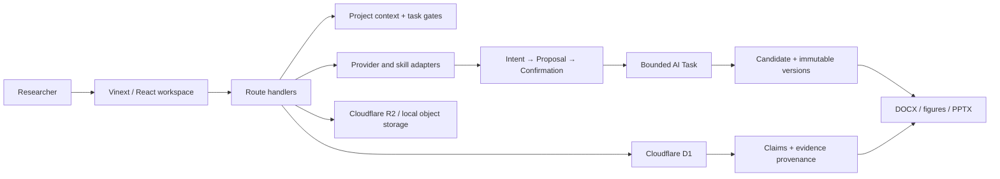

# ScholarFlow

> 把“让 AI 帮我写论文”变成一条可追踪、可复核、可拒绝的科研工作流。

[](#当前状态与已知限制)
[](#本地运行)
[](#技术架构)
[](#许可证)

ScholarFlow 是一个面向论文与科研材料的 AI 工作台原型。它不把模型输出当成答案，而是围绕项目上下文、材料来源、证据绑定、不可变版本和人工确认门组织整个流程：从研究诊断和材料解析，到写作、审阅、返修、DOCX、科研图件与 PPTX。

这个仓库公开的是一套仍在演进的工程实践，而不是一个已经完成商业化交付的产品。可运行的能力、测试边界和未解决问题都会在这里明确列出。

## 为什么做 ScholarFlow

通用聊天工具很容易丢失研究上下文，也很难回答三个关键问题：

- 这句话依据哪一份材料、哪一个位置？
- AI 修改了什么，用户是否确认采用？
- 当前页面展示的是正式版本、候选版本，还是一次失败的生成？

ScholarFlow 尝试把这些问题变成产品和数据契约，而不是只依赖提示词：

- **项目上下文**：研究目标、论文类型、语言、章节与材料范围随任务传递。
- **证据链**：Claim、Citation、MaterialChunk 与 EvidenceBinding 保留来源关系。
- **人工确认门**：ToolIntent 和 Action Proposal 必须确认后才能进入执行；候选版本不会自动覆盖正文。
- **不可变版本**：章节、审阅、返修、图件、演示文稿与导出均以追加版本记录。
- **可审计执行**：AI Task、模型配置、预算、失败状态和 Provider 运行记录可追踪。
- **隐私边界**：材料授权、处理副本、伪匿名策略和外传检查进入服务端流程。

## 已覆盖的工作流

| 工作区 | 当前实现 |
|---|---|
| 账号与项目 | 注册、登录、服务器 Session、项目所有者隔离、五种创建起点 |
| 材料与知识 | 本地 R2、TXT/CSV/BibTeX/RIS/DOCX/文本型 PDF/XLSX/图片元数据解析、项目内片段检索 |
| 渐进式诊断 | 研究信息采集、字段来源、任务级就绪判断、诊断审计 |
| AI 会话 | 六类 Skill、长期会话、摘要、ToolIntent、Action Proposal、用户确认与恢复状态 |
| 写作与版本 | 章节版本、候选版本、差异、采用/拒绝、返修任务与 Response Letter |
| 证据与审阅 | Claim/Evidence 绑定、直接引文核验、冲突/高风险阻断、高级审阅记录 |
| 导出 | 真实 DOCX OOXML、来源版本绑定、不可变导出记录 |
| 科研图件 | 统计图、机制图、理论框架、流程图、多格式资产与运行记录 |
| 汇报 | 13 类场景、PPTX 版本、图件绑定、讲者备注、来源与问答准备 |
| 管理与运维 | 用户、项目、AI Task、Provider、审计、发布门和回滚文档基础 |

## 技术架构



主要技术：Vinext、React 19、TypeScript、Cloudflare D1/R2、Drizzle ORM、Wrangler，以及用于本地科研图件和 PPTX 的受控 Runner。

当前代码规模（以本仓库公开时的 HEAD 为准）：

- 43 个 API route 文件；
- 67 个显式 HTTP handler；
- 43 个测试文件；
- 200 个声明测试用例。

数量不等于质量或生产就绪度；测试也包含需要外部凭据、Office/Artifact Tool 或特定本地环境而跳过的场景。

## 本地运行

### 环境要求

- Node.js `>=22.13.0`
- pnpm
- Windows PowerShell 是目前验证最充分的本地环境

```powershell
git clone https://github.com/OrangeDay05/ScholarFlow.git
cd ScholarFlow
pnpm.cmd install --frozen-lockfile
Copy-Item .dev.vars.example .dev.vars
pnpm.cmd dev
```

打开 [http://localhost:3000](http://localhost:3000)。本地 D1/R2 状态保存在 `.wrangler/`；开发密钥保存在被 Git 忽略的 `.dev.vars`。

### 可选：DeepSeek

只在本机 `.dev.vars` 中配置，禁止写入源码、数据库普通字段、URL、日志、截图或 Issue：

```dotenv
DEEPSEEK_API_KEY=
DEEPSEEK_BASE_URL=
```

未配置凭据时，相关能力应返回 `CREDENTIAL_REQUIRED` 或跳过真实集成测试，而不是伪装成功。

## 验证

```powershell
pnpm.cmd exec tsc --noEmit
pnpm.cmd lint
pnpm.cmd build
pnpm.cmd audit --prod --audit-level high
node scripts/m10-release-audit.mjs
```

核心测试入口：

```powershell
pnpm.cmd test
```

更完整的人工验收、发布门与回滚步骤分别见：

- [本地验收说明](docs/testing/M5-local-user-acceptance.md)
- [发布与回滚 Runbook](docs/operations/release-runbook.md)
- [状态看板](docs/status-board.md)
- [问题日志](docs/issue-log.md)
- [风险登记册](docs/risk-register.md)

## 当前状态与已知限制

ScholarFlow 当前是 **research preview / engineering prototype**，不是生产服务。以下问题不会用漂亮的 README 掩盖：

- **没有公开在线演示，也没有完成生产部署。** M11 部署、生产 D1/R2 迁移、监控与回滚演练尚未完成。
- **真实模型端到端验收不完整。** 服务端凭据与 Provider 边界已经实现，但需要用户自备测试凭据的真实 DeepSeek 场景没有形成可公开复现的完整通过证据。
- **AI 闭环仍有环境和 UI 验收边界。** 会话、提案、确认、任务、候选版本与采用的数据链已实现；不同本地状态下的完整浏览器回归仍需继续收敛。
- **不是向量检索系统。** 当前项目知识检索基于受控的已解析片段，不应描述为语义向量库或联网学术搜索。
- **扫描型 PDF 需要 OCR。** 当前不会把无法读取的扫描 PDF 假装成成功解析。
- **表格公式不会执行，图片不会被自动理解。** XLSX 记录公式与单元格来源；图片目前主要登记资产和尺寸信息。
- **外部工具链并非零配置。** 科研图件依赖本地 Python 环境；真实 PPTX 工作流依赖 Artifact Tool，部分验证在缺少该环境时会跳过。
- **本地数据库状态需要谨慎管理。** 迁移必须按台账执行；不要混用其他 worktree 的 `.wrangler`，也不要把旧测试数据当成产品默认内容。
- **浏览器视觉验收仍有已知缺口。** 某些本地浏览器安全策略与扩展可能阻止 localhost 自动化或造成 hydration 噪声，必须区分环境问题和产品问题。
- **文档存在历史里程碑命名。** `/api/m5` 等名称表示内部演进阶段，不代表当前产品只停留在 M5；后续会逐步整理，但不会为“看起来更新”而机械重命名。

如果你发现新的问题，请提交可复现步骤、期望行为、实际行为、运行环境以及去敏后的日志。不要在 Issue 中提交论文原文、账号、Token 或 API Key。

## 项目原则

1. **证据优先于生成。** 模型共识不能替代原始来源。
2. **用户确认优先于自动覆盖。** AI 只能产生候选和建议。
3. **失败必须可见。** `PARTIAL`、`SKIPPED`、`CREDENTIAL_REQUIRED` 都不是成功。
4. **本地演示不等于生产可用。** Mock、HTTP 200、可点击页面和类型定义都不能单独作为发布证据。
5. **最小权限与所有者隔离。** 项目、材料、Session、凭据和输出必须按用户边界访问。

## 贡献

目前仓库仍处于快速演进期。欢迎通过 Issue 讨论可复现缺陷、数据契约、证据追踪、科研工作流和可访问性问题。提交 Pull Request 前，请先说明变更范围和验证方式，避免把未验证能力写成已完成。

## 许可证

本仓库当前**尚未声明开源许可证**。公开可见不等于允许复制、修改、分发或商业使用；在正式选择并加入 LICENSE 之前，默认保留全部权利。
